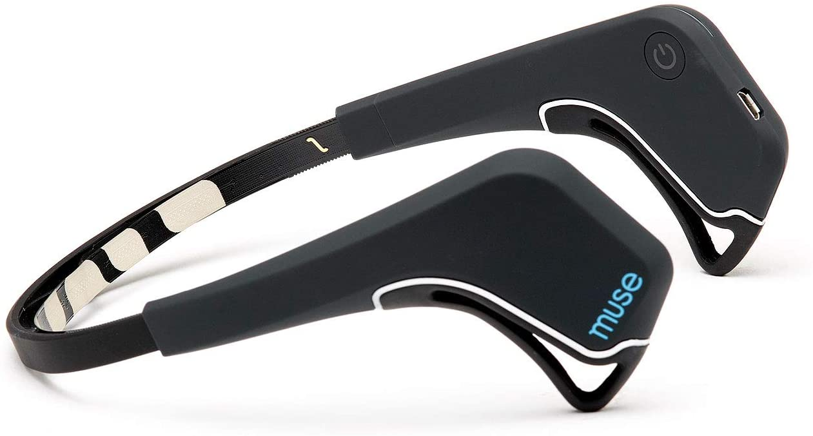
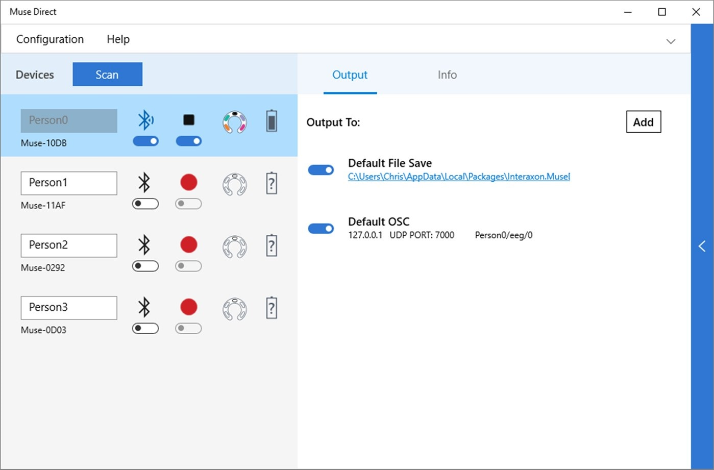

Muse Library
============

by Jungwoo Nam, InsLab

Muse Library provides a mechanism to collect OSC data sent by Muse Direct in a .NET environment.

## Usage

```csharp
using System;
using System.Threading;
using Newtonsoft.Json.Linq;
using InsLab.Muse;

class MuseLibraryUsage
{
    static void Main(string[] args)
    {
        var muse = new Muse()
        {
            DataToRead = MuseData.EEG
        };

        // Print Muse device info
        Console.WriteLine($"Muse Model = {muse.Model}");
        Console.WriteLine($"Muse Name = {muse.Name}");

        // Read data for 5 seconds
        muse.StartReading();
        Thread.Sleep(5000);
        muse.StopReading();

        var museJson = JObject.Parse(muse.ConvertDataToJson());
        File.WriteAllText("musedata.json", museJson.ToString());
    }
}
```

## Appendix

### Muse: The Brain Sensing Headband



Muse is designed to support both beginners and expers on their meditation journey.

You'll discover your mind-body connection through powerful, accurate real-time feedback on brain activity.
Real-time brain activity(EEG) feedback on your mental activity teaches you the art of focus.

**What electrode channels does Muse use?**

TP9, AF7, AF8, and TP10

### Muse Direct



Muse Direct is the first of its kind, allowing simultaneous multi-person experiences to be streamed and recorded, anytime and anywhere, making data collection in the lab or out in the field simple and portable. With its easy-to-use graphical interface, you can start verifying your algorithm without having to build an entire app first. Whether you’re building an art installation or in the early stages of app development, Muse Direct provides you with everything from raw data to out-of-the box algorithms so that you can focus on what’s most important, the data.

